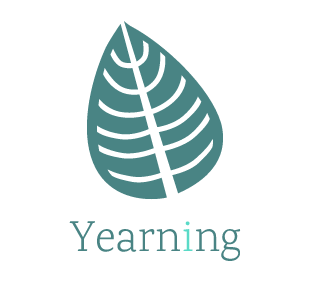

        

#SQL审核平台

  
  
 
 

##### 基于Inception的企业级web Yearning的第二开发  SQL审核平台。

## SQL Manager新增功能
- SQL查询
    - 实际公司需求查询线上数据 有查询权限即可 无需查询申请
    - 添加查询历史 
    - 添加sql收藏 
    - 查询耗时
    - 自动填充最后一次sql的执行信息
    - 可以从查询历史，我的收藏等地方直接执行sql
    - 查询报错到审计
- SQL优化
    - 基于profiling的优化
    - 其他第三方优化功能
- 工具
    - 基于binlog2sql界面操作     

## Yearing Feature 功能

- 数据库字典自动生成
- SQL查询
    - 查询工单 
    - 导出
    - 自动补全，智能提示 
- SQL可视化自动生成
    - 索引语句自动生成
    - DDL语句自动生成
- SQL审核
    - 流程化工单
    - SQL语句检测
    - SQL语句执行
    - SQL回滚
    - 历史审核记录
    - 查询语句审计
- 推送
    - 站内信工单通知
    - E-mail工单推送
    - 钉钉webhook机器人工单推送
- 其他
    - todoList
    - LDAP登陆   
- 用户权限及管理
    - 拼图式权限划分(共12项独立权限,可随意组合)

## Environment 环境

- Python 3.6

- Vue.js 2.5

- Django 2.0

## Install 安装及使用日志

详细安装步骤请访问[www.yearning.io](http://yearning.io)获得帮助

[使用及安装文档](http://supermancookie.com/Yearning-document/)

## Support 支持Yearning

如果Yearning能够帮助到你，请支持下Yearning吧，让Yearning能够持续改善并更新

  
## About 联系方式
   
   QQ:279264044
   
   E-mail: 
 
## 注意
1、使用原始inception时要替换connection.py和cursor.py文件

## Snapshot 效果展示

- Login

- Dashboard

- SQL语法高亮及自动补全

- 细粒度的权限分配

- 我的工单

## License

- Apache 2.0

2018 © Cookie

